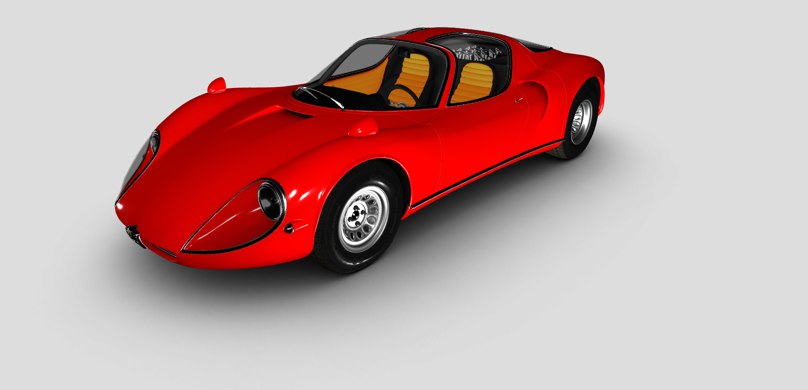

Alfa Romeo Stradale 1967 3D Model: A Timeless Masterpiece with Three.js
=======================================================================  

[Live Website](https://utkarshpathrabe.github.io/Alfa-Romeo-Stradale-1967-3D-Model/)

The Alfa Romeo Stradale 1967 3D Model is a breathtaking digital rendition of an automotive legend. Crafted with precision and artistry using Three.js, this model captures every curve, detail, and nuance of the iconic Alfa Romeo Stradale from 1967.

## Key Features:

* *Intricate Detail*: Every aspect of the Stradale, from its sleek bodywork to its distinctive features, is faithfully reproduced in stunning detail.

* *Realistic Textures*: The model showcases realistic textures that bring the car to life, making it almost indistinguishable from the real thing.

* *Interactivity*: With Three.js, users can interact with the model, rotate it, zoom in for close-ups, and appreciate the design from every angle.

* *Historical Accuracy*: This 3D model is a testament to historical accuracy, preserving the essence of a classic automobile.

The Alfa Romeo Stradale 1967 3D Model is not just a digital representation; it's a work of art that pays homage to automotive history. Whether you're an automotive enthusiast, a designer, or simply an admirer of classic cars, this model offers a captivating and immersive experience that allows you to explore the timeless beauty of the Alfa Romeo Stradale in unprecedented detail.

